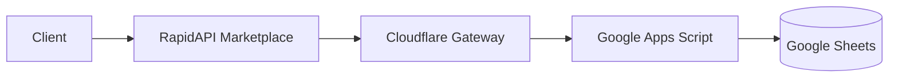

# 🚀 Central Data Hub (Zero-Cost multi-tenant SSOT)

**Central Data Hub**는 Google Sheets를 데이터베이스로, Google Apps Script를 백엔드로 활용하여 **운영 비용 0원**으로 운영되는 기업용 Single Source of Truth(SSOT) 솔루션입니다. 

Cloudflare Workers를 Gateway로 활용하여 RapidAPI의 멀티 테넌트(`X-RapidAPI-User`) 기능을 완벽하게 지원합니다.

## ✨ Key Features
- **Zero Operating Cost**: 인프라 유지비가 전혀 들지 않습니다.
- **Multi-Tenant SaaS Enabled**: RapidAPI를 통해 전 세계 유저에게 개인화된 데이터를 판매할 수 있습니다.
- **Enterprise Security**: `PROXY_SECRET` 및 Cloudflare Edge 검증을 통해 데이터를 보호합니다.
- **Real-time Monitoring**: Cloudflare Worker 에이전트가 5분마다 상태를 체크하고 보고합니다.
- **Daily Performance Report**: 매일 오전 에이전트 활동 요약 리포트를 메신저(Discord, Slack)로 발송합니다.

## 🏗 System Architecture

## 🛠 Setup & Deployment

### 1. Google Apps Script (Backend)
1. `backend.gs` 소스 코드를 복사합니다.
2. [Google Apps Script](https://script.google.com/home)에서 새 프로젝트를 생성하고 코드를 붙여넣습니다.
3. 프로젝트 설정 > 스크립트 속성에서 `PROXY_SECRET`을 설정합니다.
4. "웹 앱"으로 배포합니다 (액세스 권한: 모든 사람).

### 2. Cloudflare Worker (Gateway)
1. [Cloudflare Dashboard](https://dash.cloudflare.com/)에서 새로운 Worker를 생성합니다.
2. `cloudflare_worker.js` 코드를 붙여넣습니다.
3. Settings > Variables에서 다음 환경변수를 추가합니다:
   - `GAS_URL`: 배포된 GAS 웹앱 URL
   - `HUB_USER_ID`: 본인의 RapidAPI User ID
   - `PROXY_SECRET`: GAS에 설정한 값과 동일
4. (선택) Triggers에서 Cron Trigger(`*/5 * * * *`)를 추가하여 자동 모니터링을 활성화합니다.

### 3. RapidAPI Configuration
1. RapidAPI Provider Dashboard에서 API를 등록합니다.
2. **Target URL**을 Cloudflare Worker URL로 설정합니다.
3. Request Transformation을 통해 헤더가 올바르게 전달되는지 확인합니다.

## 📄 License
This project is open-source and available under the MIT License.
